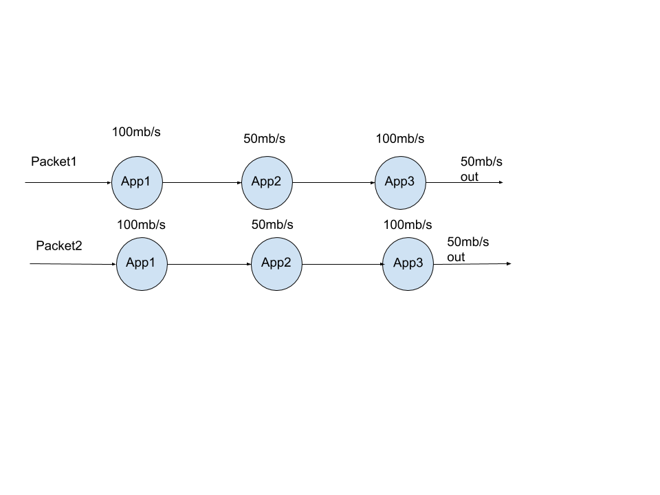
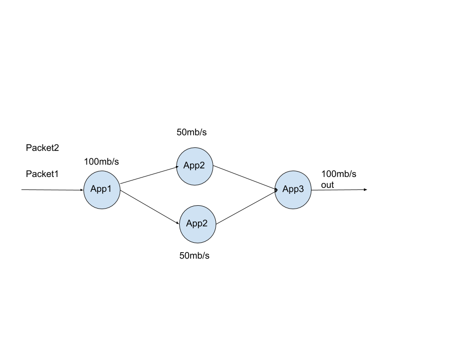

# SDSoc-Examples-Fall2019

Putting more pieces together!

# Repo Contents

In this repo we will see a more complex system within the FPGA. We will see the use of the async and resource inside and outside the FPGA to create multiple hardware instances to speed up our system. We will also see streaming used through out the system and an example of how to stream something inside the system with variable length.

# Homework 6 refresher

In Homework 6 you shold have learned about DMA transfers using async, and instantiating multiple resources at a top level

So now you can do something like this! Where we can process packets in hardware in parallel to achieve high throughput.

In the below picture we see we can achieve a throught put of 50mb/s with one application and 100mb/s with two.

# Homework 7 refresher

In homework 7 you should have been exposed to streaming between two applications inside the FPGA.

You could be thinking to yourself I don't need to make a whole instance of all those applications to achieve 100mb/s I just need to add more of a certain application.

So something like we see below.

We want to identify our bottle necks at the source, thus utilizing less resources. We do not necessarily need a whole new pipeline. That could be costly on hardware!
We just need another piece of the puzzle.

# Ending remarks

This repo shows us how we can do that and shows some other techniques that may be helpful when implementing the project. 

Your design may and will probably be different. But, this can help give ideas or inspire you to think of new ideas.

I would suggest reading through the code examining the .cpp and .h files. There are questions that may give you ideas or inspire thoughts.

Please Come to OH or post on piazza with any questions that you may have about this repo.

Goodluck!

# weird compiler Errors encountered

Error : Fix

No function body: changed all uint8_t and uint16_t to unsigned char or short. It looks like these typedefs 

TODO add screenshots to prove multiple resources and dataflow is running concurrently inside. maybe emulation will help

ignore 
ALL RESOURCES
Average number of CPU cycles in hardware: 939828
TEST PASSED 

NO RESOURCE IN FPGA
same

No resource shows same resource in utilazation. I am lead to believe that you may need anything extra

