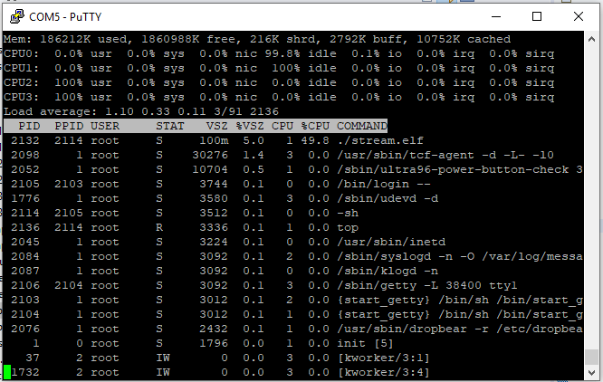

# SDSoc-Examples-Fall2019

Putting more pieces together!

# Repo Contents

In this repo we will see a more complex system within the FPGA. We will see the use of the async and resource inside and outside the FPGA to create multiple hardware instances to speed up our system. We will also see streaming used through out the system and an example of how to stream something inside the system with variable length.

# Homework 6 refresher

In Homework 6 you shold have learned about DMA transfers using async, and instantiating multiple resources at a top level

So now you can do something like this! Where we can process packets in hardware in parallel to achieve high throughput.

In the below picture we see we can achieve a throught put of 50mb/s with one application and 100mb/s with two.

# Homework 7 refresher

In homework 7 you should have been exposed to streaming between two applications inside the FPGA.

You could be thinking to yourself I don't need to make a whole instance of all those applications to achieve 100mb/s I just need to add more of a certain application.

So something like we see below.

We want to identify our bottle necks at the source, thus utilizing less resources. We do not necessarily need a whole new pipeline. That could be costly on hardware!
We just need another piece of the puzzle.

# Emulation output

Look, in this time frame we can verify that we have two application2's running concurrently

# Resource output

In this file we can see that the resources are being accounted for. This file is loated is in the reports folder under bug. compute_hw.rpt and stream.rpt

Below we see we that it has built two separate application2's like we wanted.

Below we see our utilization when we use the resource pragma to create two separate instances.

Below we see our utilization when we do not. This can be our hint that we are on the right track.

# Binding threads

you will see in the picture below that our core utilization for 2 and 3 is at 100%. 
In a test example I ran I created two worker threads and bound one to core 2 and one to core 3. The functions they entered were simply
while(1) loops so we could see processor utilization. 

# Ending remarks

This repo shows us how we can do that and shows some other techniques that may be helpful when implementing the project. 

Your design may and will probably be different. But, this can help give ideas or inspire you to think of new ideas.

I would suggest reading through the code examining the .cpp and .h files. There are questions that may give you ideas or inspire thoughts.

Please Come to OH or post on piazza with any questions that you may have about this repo.

Goodluck!

# Errors encountered

Child threads can not send data using zero copy pragma. But DMA channels were verified on child threads as well as on separate cores.

// wide memory data sending not an error but a performance bonus to look into.
https://github.com/Xilinx/SDSoC_Examples/blob/master/cpp/getting_started/wide_memory_rw/src/main.cpp

